_Catlike Coding: Unity C# Tutorials_

# Game Objects and Scripts: Creating a Clock

_by Jasper Flick_

    Build a clock with simple objects.
    Write a C# script.
    Rotate the clock's arms to show the time.
    Animate the arms.

In this tutorial we will create a simple clock and program a component to have it display the current time. You only need a minimal understanding of the Unity editor. If you've played with it for a few minutes and know how to navigate the Scene window then you're good to go.

This tutorial assumes you're using at least Unity 2017.1.0.

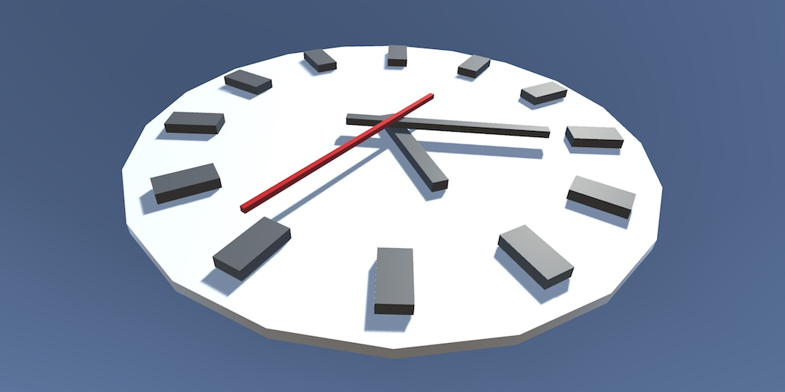

_It is time to create a clock._

## 1: Building a Simple Clock

Open Unity and create a new 3D project. You don't need any extra asset packages and you also don't need analytics. If you haven't customized the editor yet, you will end up with its default window layout.

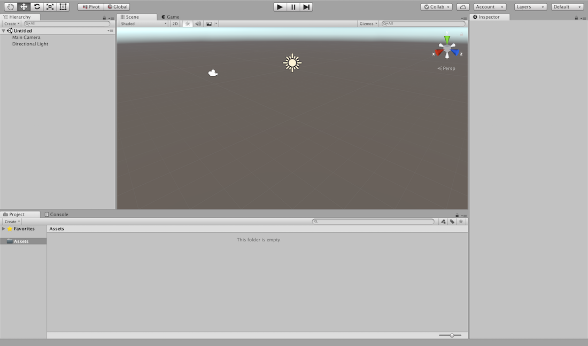

_Default window layout._

I use a different layout, the 2 by 3 preset which you can select from the dropdown list at the top right corner of the editor. I customize that one further by switching the Project window to One Column Layout, which better fits its vertical orientation. You can change it via the small dropdown list next to it's lock icon, at the top right of the window above its toolbar. I also disabled Show Grid in the Scene window, via its Gizmos dropdown menu.

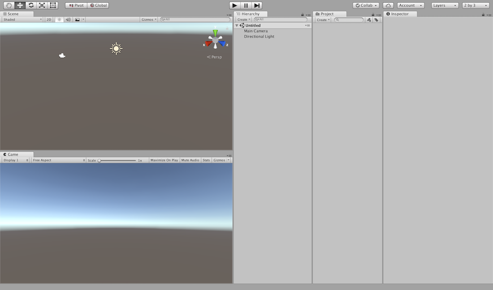
Customized 2-by-3 layout.

>**Why is my Game window small with a dark border?**
That can happen when using a high-resolution display. To make it expand and fill the entire Game window, open the aspect-ratio dropdown menu of the game window and disable the Low Resolution Aspect Ratios option.
>
>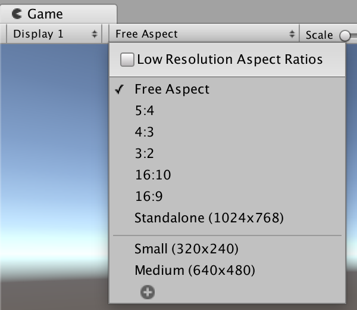
>
>_Low resolution aspect ratios disabled._

### 1.1: Creating a Game Object

The default scene contains two game objects. They are listed in the Hierarchy window and you can also see their icons in the Scene window. First is the Main Camera, which is used to render the scene. The Game window is rendered using this camera. Second is the Directional Light, which illuminates the scene. To create your own game object, use the GameObject / Create Empty option. You can also do this via the context menu of the Hierachy window. This adds a new object to the scene, which you can immediately give a name. As we're going to
create a clock, name it Clock.

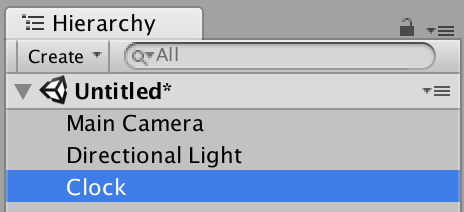

_Hierarchy with clock object._

The Inspector window shows the details of game objects. When our clock object is selected, it will contain a header with the object's name plus a few configuration options. By default, the object is enabled, is not static, doesn't have a tag, and belongs to the default layer. These settings are fine for us. Below that, it shows a list of all the components of the game object. There is always a Transform component, which is all our clock currently has.

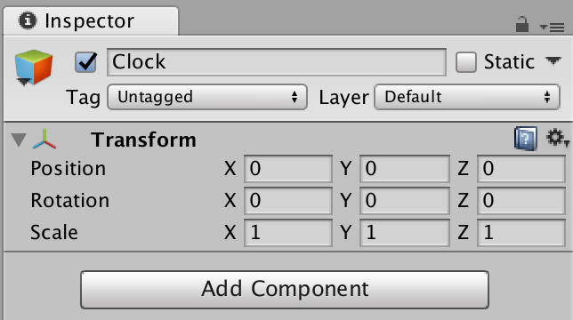

_Inspector window with clock selected._

The *Transform* component contains the position, rotation, and scale of the object in 3D space. Make sure that the clock's position and rotation are both 0. Its scale should be 1.

>**What about 2D objects?** When working in 2D instead of 3D, you can ignore one of the three dimensions. Objects specifically meant for 2D – like UI elements – typically have a _Rect Transform_, which is a specialized _Transform_ component.

### 1.2: Creating the Face of the Clock

Although we have a clock object, we don't see anything yet. We'll have to add 3D models to it so they get rendered. Unity contains a few primitive objects that we can use to build a simple clock. Let's begin by adding a cylinder to the scene via GameObject / 3D Object / Cylinder. Make sure that it has the same Transform values as our clock.

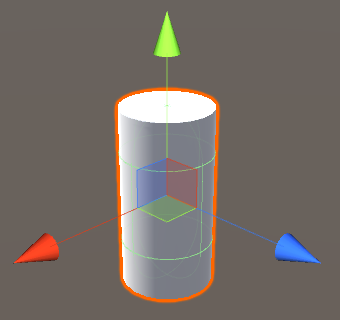
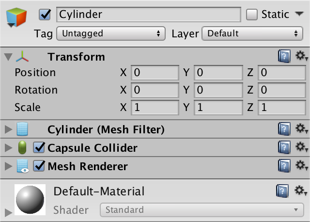

_Game object representing a cylinder._

The new object has three more components than an empty game object. First, it has a Mesh Filter, which simply contains a reference to the built-in cylinder mesh. Second is a Capsule Collider, which is for 3D physics. Third is a Mesh Renderer. That component is there to ensure that the object's mesh gets rendered. It also controls which material is used for rendering, which is the built-in Default-Material unless you change it. This material is also shown in the inspector, below the component list.

Although the object represents a cylinder, it has a capsule collider, because Unity doesn't have a primitive cylinder collider. We don't need it, so we can remove that component. If you'd like to use physics with your clock, you're better off using a Mesh Collider component. Components can be removed via the dropdown menu with a gear icon, in their top right corner.

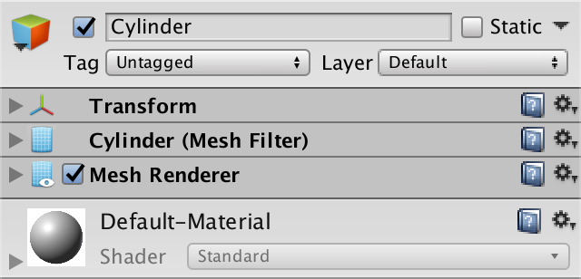

_No more collider._

To turn the cylinder into a clock face, we have to flatten it. This is done by decreasing the Y component of its scale. Reduce it to 0.1. As the cylinder mesh is two units high, its effective height becomes 0.2 units. Let's also make a big clock, so increase the X and Z components of its scale to 10.

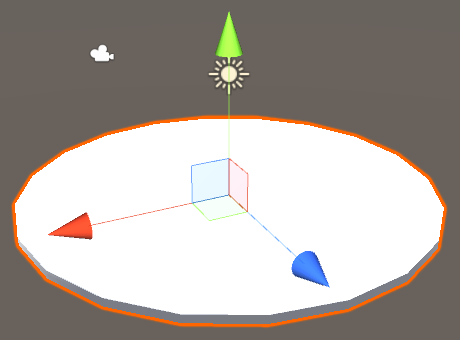
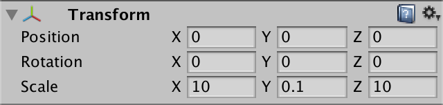

_A scaled cylinder._

Change the name of the cylinder object to Face, as it represents the face of the clock. It is part of the clock, so make it a child of the Clock object. You can do this by dragging the face onto the clock in the Hierarchy window.

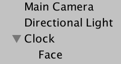

_Face child object._

Child objects are subject to the transformation of their parent object. This means that when Clock changes position, Face does as well. It's as if they were a single entity. The same goes for rotation and scale. You can use this to make complex object hierarchies.

### 1.3: Creating the Clock Periphery

The outer ring of a clock's face usually has markings that help indicate what time it is displaying. This is known as the clock periphery. Let's use blocks to indicate the hours of a 12-hour clock. Add a cube object to the scene via GameObject / 3D Object / Cube. Change its scale to (0.5, 0.2, 1) so it becomes a narrow flat long block. It is now located inside the clock's face. Set its position to (0, 0.2, 4). That places it on top of the face and to the side that corresponds with the 12th hour. Name it Hour Indicator.

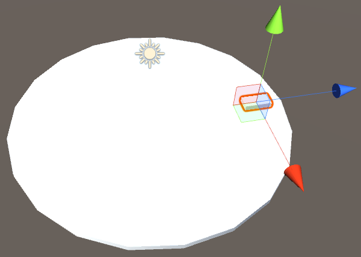
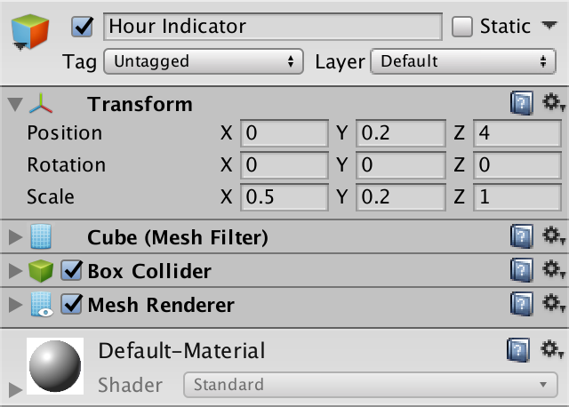

_Indicator for the 12th hour._

The indicator is hard to see, because it has the same color as the face. Let's create a separate material for it, via Assets / Create / Material, or via the context menu of the Project window. This gives us a material asset that is a duplicate of the default material. Change its Albedo to something darker, like 73 for red, green, and blue. That results in a dark gray material. Give it an appropriate name, like Clock Dark.

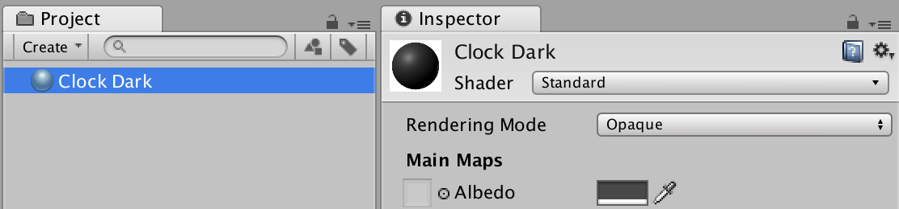
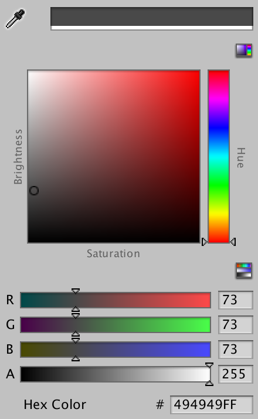

_Dark material asset and color popup._

>**What is albedo?**
Albedo is a Latin word which means whiteness. It's simply the color of a material.

Make the hour indicator use this material. You can do this by dragging the material onto the object in either the scene or hierarchy window. You can also drag it to the bottom of the inspector window, or change Element 0 of the mesh renderer's Materials array.

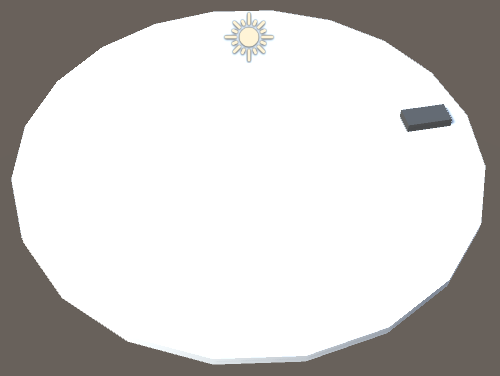

_Dark hour indicator._

Our indicator is correctly positioned for hour 12, but what if we wanted to indicate hour 1? As there are twelve hours and a full circle has 360°, we'd have to rotate the indicator 30° around the Y axis. Let's give that a try.

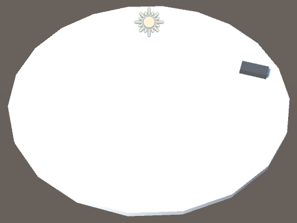
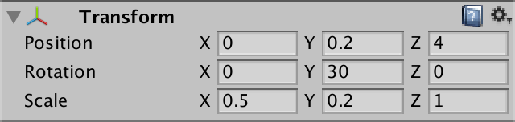

_Rotated hour indicator, incorrectly positioned._

While this gives us the correct orientation, the indicator is still in the position for hour 12. This is the case because an object's rotation is relative to its own local origin, which is its position. We have to move the indicator along the edge of the face to align it with hour 1. Instead of figuring out this position ourselves, we can use the object hierarchy to do this for us. First reset the indicator's rotation to 0. Then create a new empty object, with position and rotation 0 and scale 1. Make the indicator a child of that object.

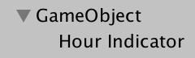

_Temporary parent._

Now set the parent's Y rotation to 30°. The indicator will rotate as well, effectively orbiting it's parent's origin, and ends up exactly where we want it to be.

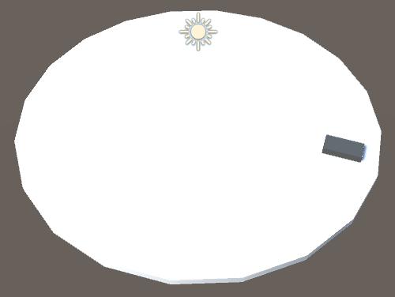

Correctly positioned hour indicator.

Duplicate the temporary parent, with Control or Command D, or via the context menu in the hierarchy. Increase the Y rotation of the duplicate by another 30°. Keep doing this until you end up with one indicator per hour.

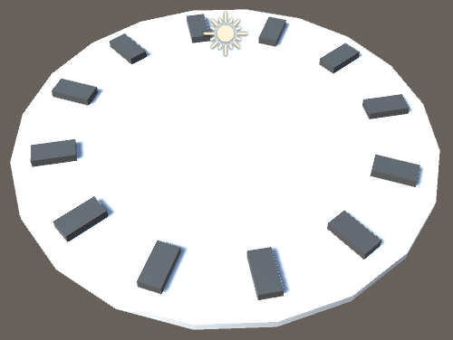

_Twelve hour indicators._

We no longer need the temporary parents. Select one of the hour indicators in the hierarchy and drag it onto the clock. It has now become a child of the clock. When this happened, Unity changed the indicator's transformation so its position and rotation didn't change in world space. Repeat this for all twelve indicators, then delete the temporary parent objects. You can speed this up by selecting multiple objects at the same time, via control- or command-clicking.

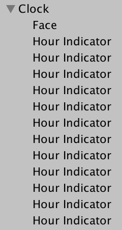

_Periphery children._

>**I'm seeing values like 90.00001. Is that a problem?**
That happens because the position, rotation, and scale components are floating-point numbers. These numbers have limited precision, which can cause minuscule deviations from the numbers you'd expect. You don't have to worry about deviations of 0.00001 as they're not perceivable.

### 1.4: Creating the Arms

We can use the same approach to construct the arms of the clock. Create another cube named Arm and give it the same dark material that the indicators use. Set its scale to `(0.3, 0.2, 2.5)` so it's narrower and longer than the indicators. Set its position to `(0, 0.2, 0.75)` so it sits on top of the face and points towards hour 12, but also a bit in the opposite direction. That makes it look as if the arm has a little counterweight when it rotates.

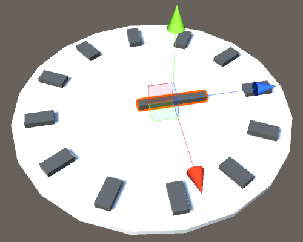
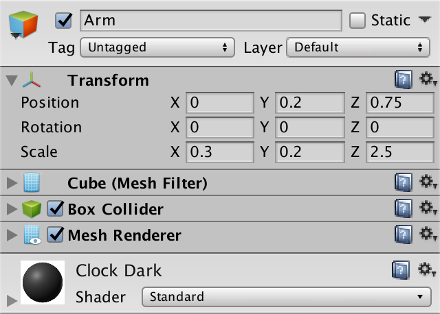

_Hours arm._

>**Where did the light's gizmo go?**
I moved the light out of the way, so it no longer clutters the scene view. As it is a directional light, its position doesn't matter.

To make the arm pivot around the center of the clock, create a parent object for it, like we did to position the hour indicators. Again make sure that its transformation has the default values of 0 for position and rotation and 1 for scale. Because we'll be rotating the arm later, make this parent a child of the clock and name it Hours Arm. So Arm ends up as a grandchild of Clock.

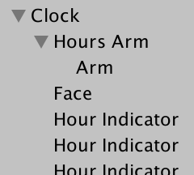

_Clock hierarchy with hours arm._

Duplicate Hours Arm twice to create Minutes Arm and Seconds Arm. The minutes arm should be narrow and longer than the hours arm, so set its Arm child object's scale to (0.2, 0.15, 4) and its position to (0, 0.375, 1). That way it ends up on top of the hours arm. For the child of Seconds Arms, use scale (0.1, 0.1, 5) and position (0, 0.5, 1.25). To differentiate it further, I created a Clock Red material with the RGB values of its albedo set to (197, 0, 0) and made the Arm child use that.

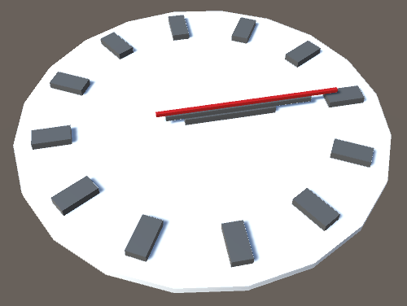
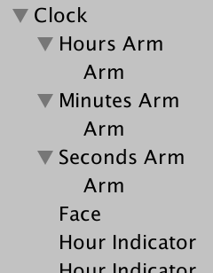

_All three arms._

Our clock has now been constructed. If you haven't done so already, this is a good moment to save the scene. It will be stored as an asset in the project.

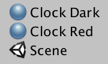

_Saved scene._

## 2: Animating the Clock

Our clock currently does not tell the time. It's just an object hierarchy, which causes Unity to render a bunch of meshes. Nothing more. Had there been a default clock component, we could've used that to do some time-telling. As there isn't one, we'll have to create our own. Components are defined via scripts. Add a new script asset to the project via Assets / Create / C# Script and name it Clock.

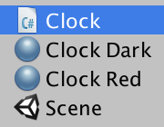
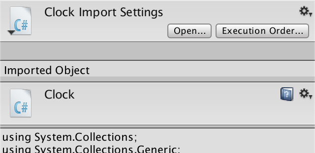

_Clock script asset._

When the script is selected, the inspector will show its contents, and a button to open the file in a code editor. You can also double-click the asset to open the editor. The script file will contain the default code template for a component, shown below.

```csharp
using System.Collections;
using System.Collections.Generic;
using UnityEngine;

public class Clock : MonoBehaviour {
  // Use this for initialization
  void Start () {
  }

  // Update is called once per frame
  void Update () {
  }
}
```

This is C# code. It's the programming language used for scripting in Unity. To understand how the code works, we'll delete it all and start from scratch.

>**What about JavaScript?**
Unity also supported another programming language, usually referred to as JavaScript, but its actual name is UnityScript. Unity 2017.1.0 still supports it, but the menu item to create a JavaScript asset will be removed in Unity 2017.2.0. Expect support to be dropped entirely after that.

### 2.1: Defining a Component Type

An empty file is not a valid script. It must contain the definition of our clock component. We don't define a single instance of a component. Instead, we define the general class or type known as Clock. Once that's established, we could create multiple such components in Unity. In C#, we define the Clock type by first stating that we're defining a class, following by its name. In the code fragments below, changed code has a yellow background. As we start with an empty file, the contents of it should literally become class Clock and nothing else,
though you could add spaces and newlines between words as you like.

```csharp
class Clock
```

>**What's a class, technically?**
You can think of a class as a blueprint that can be used to create objects that reside in a computer's memory. The blueprint defines what data these objects can contain and what functionality they have. Classes can also define data and functionality that doesn't belong to objects, but to the class itself. This if often used to provide globally-available functionality.

Because we don't want to restrict which code has access to our Clock, it is good form to prefix it with the public access modifier.

```csharp
public class Clock
```

>**What is the default access modifier for classes?**
Without the access modifier, it would be as if we had written internal class Clock. That would restrict access to code from the same assembly, which becomes relevant when you use code packaged in multiple DLL files. To make sure it always works, make classes public by default.

At this point we don't have valid C# syntax yet. We indicated that we're defining a type, so we must actually define what it is like. That's done by a block of code that follows the declaration. The boundaries of a code block are indicated with curly brackets. We're leaving it empty for now, so just use `{}`.

```csharp
public class Clock {}
```

Our code is now valid. Save the file and switch back to Unity. The Unity editor will detect that the script asset has changed and triggers a recompilation. After that is done, select our script. The inspector will inform us that the asset does not contain a MonoBehaviour script.

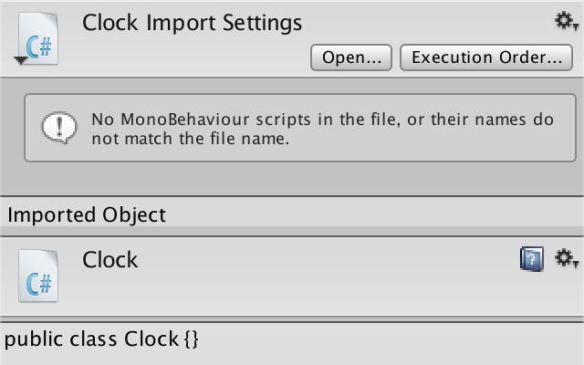

_Non-component script._

What this means is that we cannot use this script to create a component in Unity. At this point, our Clock defines a generic C# object type. Unity can only use subtypes of MonoBehaviour to create components.

>**What does MonoBehavion mean?**
The idea is that we can program our own components to add custom behavior to game objects. That's what the behavior part refers to. It just happens to use the British spelling, which is an oddity. The mono part refers to the way in which support for custom code was added to Unity. It used the Mono project, which is a multi-platform implementation of the .NET framework. Hence, MonoBehaviour. It's an old name that we're stuck with due to backwards-compatibility.

To turn Clock into a subtype of MonoBehaviour, we have to change our type declaration so that it extends that type, which is done with a colon. This makes Clock inherit all the functionality of MonoBehaviour.

```csharp
public class Clock : MonoBehaviour {}
```

However, this will result in an error after compilation. The compiler complains that it cannot find the MonoBehaviour type. This happens because the type is contained in a _namespace_, which is UnityEngine. To access it, we have to use its fully-qualified name, `UnityEngine.MonoBehaviour.`

```csharp
public class Clock : UnityEngine.MonoBehaviour {}
```

>**What's a namespace?**
A namespace is like a website domain, but for code. Just like domains can have subdomain, namespaces can have subnamespaces. The big difference is that it's written the other way around. So instead of forum.unity3d.com it would be com.unity3d.forum. The code comes with Unity, you don't have to go online to fetch it separately. Namespaces are used to organize code and prevent name clashes.

Because it is inconvenient to always have to use the UnityEngine prefix when accessing Unity types, we can tell the compiler to search this namespace when we don't explicitly mention any. This is done by adding `using UnityEngine;` at the top of the file. The semicolon is required to mark the end of the command.

```csharp
using UnityEngine;

public class Clock : MonoBehaviour {}
```

Now we can add our component to our clock game object in Unity. This can be done either by dragging the script asset onto the object, or via the Add Component button at the bottom of the object's inspector.

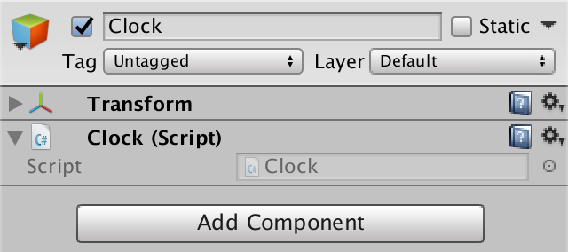

_Clock with our component._

A C# object instance has now been created, using our Clock class as a template. It has been added to the component list of the Clock game object.

### 2.2: Getting Hold of an Arm

To rotate the arms, Clock objects need to know about them. Let's start with the hours arm. Like all game objects, it can be rotated by changing the rotation of its transform component. So we have to add knowledge of the hour arm's transform component to Clock. This can be done by adding a data field inside its code block, defined as a name followed by a semicolon.

Hours transform would be an appropriate name. However, names have to be single words. The convention is to make the first word of a field name lowercase and capitalize all other words, then stick them together – this is called *camel case*. So it becomes `hoursTransform.`

```csharp
public class Clock : MonoBehaviour {
  hoursTransform;
}
```

>**Where did the using statement go?**
It's still there, I just didn't show it. The code fragments will contain enough of the existing code so you know the context of the changes.

We also have to define the type of the field, which in this case is
`UnityEngine.Transform.` It has to be placed in front of the name's field.

```csharp
Transform hoursTransform;
```

Our class now defines a field that can hold a reference to another object, whose type has to be Transform. We have to make sure that it holds a reference to the transform component of the hours arm. Fields are private by default, which means that they can only be accessed by the code belonging to Clock. But the class doesn't know about our Unity scene. By making the field public, anyone can change its contents.

```csharp
public Transform hoursTransform;
```

>***Aren't public fields bad form?***
In general, the consensus is to avoid creating public fields while programming. However, public fields are needed to hook things up in the Unity editor. While you could work around that, it makes the code less straightforward.

Once the field is public, it will show up in the inspector window. This happens because the inspector automatically makes all public fields of components editable.

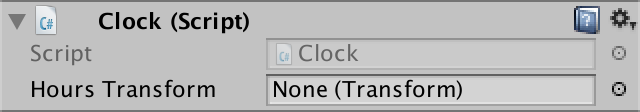

Hours transform field.

To make the proper connection, drag the Hours Arm from the hierarchy onto the Hours Transform field. Alternatively, use the circular button at the right of the field and search for Hours Arm.

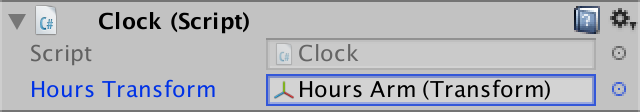

Hours transform connected.

After dragging or selecting the hours arm object, the Unity editor grabs its transform component and puts a reference to it in our field.

### 2.3: Animating All Three Arms

We have to do the same for the minutes and seconds arms. So add two more appropriately-named fields to Clock.

```csharp
public Transform hoursTransform;
public Transform minutesTransform;
public Transform secondsTransform;
```

It is possible to make these field declarations more concise, because they share the same access modifier and type. They can be consolidated into a comma-separated list of field names following the access modifier and type.

```csharp
public Transform hoursTransform, minutesTransform, secondsTransform;
// public Transform minutesTransform;
// public Transform secondsTransform;
```

>**What does `//` do?**
Double slashes indicate a comment. All text after them until the end of the line is ignored by the compiler. It is used to add text to clarify code, if needed. I also use it to indicate code that has been removed. Deleted code also has a line through it.

Hook up the other two arms in the editor as well.

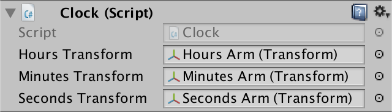

_All three arms connected._

### 2.4: Knowing the Time

Now that we can reach the arms in Clock, the next step is to figure out the current time. To do this, we need to tell Clock to execute some code. This is done by adding a code block to the class, known as a method. The block has to be prefixed by a name, which is capitalized by convention. We'll name it Awake, suggesting that the code should be executed when the component awakens.

```csharp
public class Clock : MonoBehaviour {
  public Transform hoursTransform, minutesTransform, secondsTransform;
  Awake {}
}
```

Methods are somewhat like mathematical functions, for example
*f(x) = 2x + 3.*
That function takes a number, doubles it, then adds three. It operates on a single number, and its result is a single number as well. In the case of a method, it's more like
*f(p) = c*
where *p* represents input parameters and *c* represents code execution. As that's rather generic, what is the result of such a function? That has to be mentioned explicitly. In our case, we just want to execute some code, without providing a resulting value. In other words, the result of the method is `void.` We indicated this with the `void` prefix.

```csharp
void Awake {}
```

We also don't need any input data. However, we still have to define the method's parameters, as a comma-separated list between round brackets. It's just empty in our case.

```csharp
void Awake () {}
```

We now have a valid method, although it doesn't do anything yet. Like Unity detected our fields, it also detects this Awake method. When a component has an Awake method, Unity will invoke that method when the component awakens. This happens after it's been created or loaded.

>**Doesn't Awake have to be public?**
Awake and a collection of other methods are considered special by Unity. It will find them and invoke them when appropriate, no matter how we declare them. We shouldn't make these methods public, because they're not intended to be invoked by anything other than the Unity engine.

To test whether this works, let's have Awake create a debug message. The UnityEngine.Debug class contains a publicly-available Log method for this purpose. We'll pass it a simple string of text to print. Strings are written between double quotes. Again, a semicolon is required to mark the end of an expression.

```csharp
void Awake () {
  Debug.Log("Test");
}
```

Enter play mode in the Unity editor. You'll see the test string show up in the status bar at the bottom of the editor. You can also see it in the console window, which you can open via Window / Console. The console provides some additional information, like which code generated the message, when you select the logged text. Now that we know that our method works, let's figure out the current time when it is invoked. The UnityEngine namespace contains a Time class, which in turn contains a time property. It seems obvious to use that, so let's log it.

```csharp
void Awake () {
  Debug.Log(Time.time);
}
```

>**What's a property?**
A property is a method that pretends to be a field. It might be read-only or write-only. The C# convention is to capitalize properties, but Unity often doesn't do this.

It turns out to always log the value 0. That's because Time.time tells us how many seconds have passed since entering play mode. As our Awake method gets invoked immediately, no time has passed yet. So this doesn't tell us the real time.

To access the system time of the computer we're running on, we can use the DateTime structure. This isn't a Unity type, it is found in the System namespace. It's part of the core functionality of the .NET framework, which is what Unity uses to support scripting.

>**What is a structure?**
A structure is a blueprint, just like a class. The difference is that whatever it creates is treated as a simple value, like an integer or color, instead of an object. It has no sense of identity. Defining your own structure works the same as defining a class, except you use struct instead of class.

DateTime has a publicly-accessible Now property. It produces a DateTime value that contains the current system date and time. Let's log it.

```csharp
DateTime

using System;
using UnityEngine;

public class Clock : MonoBehaviour {
  public Transform hoursTransform, minutesTransform, secondsTransform;
  void Awake () {
    Debug.Log(DateTime.Now);
  }
}
```

Now we get a timestamp logged each time we enter play mode.

### 2.5: Rotating the Arms

The next step is to rotate the clock's arms based on the current time. Let's again start with the hours. DateTime has an Hour property that gets us the hours portion of a DateTime value. Invoking it on the current timestamp will give us the hour of the day.

```csharp
void Awake () {
  Debug.Log(DateTime.Now.Hour);
}
```

We can use that to construct a rotation. Rotations are stored in Unity as quaternions. We can create one via the publicly-available `Quaternion.Euler` method. It has regular angles for the X, Y, and Z axis as parameters and produces an appropriate quaternion.

```csharp
void Awake () {
  // Debug.Log(DateTime.Now.Hour);
  Quaternion.Euler(0, DateTime.Now.Hour, 0);
}
```

>**What's a quaternion?**
Quaternions are based on complex numbers and are used to represent 3D rotations. While harder to understand than simple 3D vectors, they have some useful characteristics. For example, they don't suffer from gimbal lock.
>
>`UnityEngine.Quaternion` is used as a simple value. It is a structure, not a class.

All three parameters are real numbers, which are represented in C# by floating-point values. To explicitly declare that we're supplying the method with such numbers, let's add the `f` suffix to both zeros.

```csharp
Quaternion.Euler(0f, DateTime.Now.Hour, 0f);
```

Our clock has twelve hour indicators set at 30° intervals. To make the rotation match that, we have to multiply the hours by 30. Multiplication is done with an asterisk.

```csharp
Quaternion.Euler(0f, DateTime.Now.Hour * 30f, 0f);
```

To make it clear that we're converting from hours to degrees, we can define an appropriately-named field for the conversion factor. As it is a floating-point value, it's type is float. Because we already know the number, we can immediately assign it as part of the field declaration.

```csharp
float degreesPerHour = 30f;
public Transform hoursTransform, minutesTransform, secondsTransform;

void Awake () {
  Quaternion.Euler(0f, DateTime.Now.Hour * degreesPerHour, 0f);
}
```

The amount of degrees per hour isn't supposed to change. We can enforce this by adding the const prefix to our declaration. This turns `degreesPerHour` into a constant.

```csharp
const float degreesPerHour = 30f;
```

>**What's special about constants?**
The `const` keyword indicates that a value will never change and doesn't need to be a field. Instead, its value will be computed during compilation and is substituted for all usage of the constant. This is only possible for "primitive" types like numbers.

At this point we have a rotation, but don't do anything with it yet, so it's simply discarded. To apply it to the hours arm, we have to assign it to the `localRotation` property of it's `transform` component.

```csharp
void Awake () {
  hoursTransform.localRotation =
    Quaternion.Euler(0f, DateTime.Now.Hour * degreesPerHour, 0f);
}
```

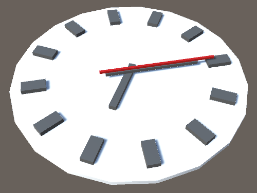

_Hour hand at 4 o'clock._

>**What's local about the rotation?**
`localRotation` refers to the actual rotation of a `transform` component, independent of the rotation of its parents. In other words, it is the rotation in the object's local space. It's what gets displayed in its transform component in the inspector. So if we were to rotate the clock's root object, its arms would rotate along with it, as we would expect. These is also a rotation property. It refers to the final rotation of a transform component in world space, taking the transformations of its parents into account. Had we used that, the arms would not adjust when we rotate the clock, as its rotation will be compensated for.

The hours arm now jumps to the correct orientation when entering play mode. Let's give the same treatment to the other two arms. Both a minute and a second take up six degrees.

```csharp
const float
degreesPerHour = 30f,
degreesPerMinute = 6f,
degreesPerSecond = 6f;
public Transform hoursTransform, minutesTransform, secondsTransform;

void Awake () {
  hoursTransform.localRotation =
    Quaternion.Euler(0f, DateTime.Now.Hour * degreesPerHour, 0f);
  minutesTransform.localRotation =
    Quaternion.Euler(0f, DateTime.Now.Minute * degreesPerMinute, 0f);
  secondsTransform.localRotation =
    Quaternion.Euler(0f, DateTime.Now.Second * degreesPerSecond, 0f);
}
```

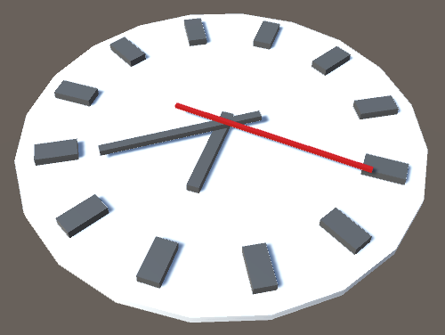

_Clock displaying 16:29:06._

We're using DateTime.Now three times, to retrieve the hour, minute, and second. Each time we go through the property again, which requires some work, which could theoretically result in different time values. To make sure that this doesn't happen, we should retrieve the time only once. We can do this by declaring a variable inside the method and assign the time to it, then use this value afterwards.

>**What's a variable?**
A variable acts like a field, except that it exists only while a method is being executed. It belongs to the method, not the class.

```csharp
void Awake () {
  DateTime time = DateTime.Now;
  hoursTransform.localRotation =
    Quaternion.Euler(0f, time.Hour * degreesPerHour, 0f);
  minutesTransform.localRotation =
    Quaternion.Euler(0f, time.Minute * degreesPerMinute, 0f);
  secondsTransform.localRotation =
    Quaternion.Euler(0f, time.Second * degreesPerSecond, 0f);
}
```

### 2.6: Animating the Arms

We get the current time when entering play mode, but after that the clock remains motionless. To keep the clock synchronized with the current time, change the name of our Awake method to Update. This method gets invoked by Unity every frame instead of just once, as long as we stay in play mode.

```csharp
void Update () {
  DateTime time = DateTime.Now;
  hoursTransform.localRotation =
    Quaternion.Euler(0f, time.Hour * degreesPerHour, 0f);
  minutesTransform.localRotation =
    Quaternion.Euler(0f, time.Minute * degreesPerMinute, 0f);
  secondsTransform.localRotation =
    Quaternion.Euler(0f, time.Second * degreesPerSecond, 0f);
}
```

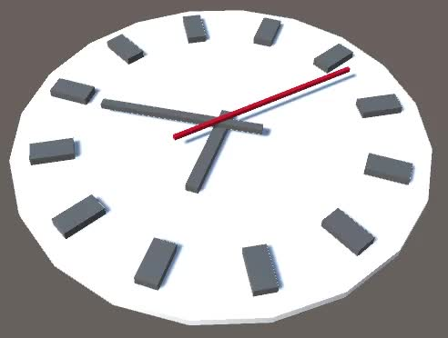

_Clock that stays up to date._

Note that our component has also gained a toggle in front of its name in the inspector. This allows us to disable the component, which prevents Unity from invoking its Update method.

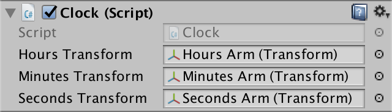

_Now with enabled toggle._

### 2.7: Continuously Rotating

The arms of our clock indicate exactly the current hour, minute, or second. It behaves like a digital clock, discrete but with arms. Many clocks have slowly-rotating arms that provide an analog representation of time. Either approach works, so let's make this configurable by adding a toggle to our component's inspector. Add another public field to Clock, named continuous. It can be either on or off, for which we can use the boolean type, declared with `bool`.

```csharp
public Transform hoursTransform, minutesTransform, secondsTransform;
public bool continuous;
```

Booleans values are either true or false, which correspond to on and off in our case. They're false by default, so turn it on once the field appears in the inspector.

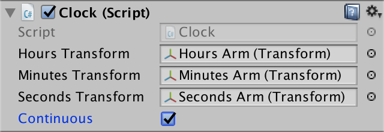

_Using the continuous option._

We now have two approaches to support. To prepare for this, duplicate our `Update` method and rename them to `UpdateContinuous` and `UpdateDiscrete`.

```csharp
void UpdateContinuous () {}
  DateTime time = DateTime.Now;

  hoursTransform.localRotation =
    Quaternion.Euler(0f, time.Hour * degreesPerHour, 0f);
  minutesTransform.localRotation =
    Quaternion.Euler(0f, time.Minute * degreesPerMinute, 0f);
  secondsTransform.localRotation =
    Quaternion.Euler(0f, time.Second * degreesPerSecond, 0f);
}

void UpdateDiscrete () {
  DateTime time = DateTime.Now;

  hoursTransform.localRotation =
    Quaternion.Euler(0f, time.Hour * degreesPerHour, 0f);
  minutesTransform.localRotation =
    Quaternion.Euler(0f, time.Minute * degreesPerMinute, 0f);
  secondsTransform.localRotation =
    Quaternion.Euler(0f, time.Second * degreesPerSecond, 0f);
}
```

Create a new `Update` method. If `continuous` is `true`, then it should invoke `UpdateContinuous`. This can be done with an `if` statement. The `if` keyword is followed by an expression within round brackets. If that expression evaluates as true, then the code block following it is executed. Otherwise, the code block is skipped.

```csharp
void Update() {
  if (continuous) {
    UpdateContinuous();
  }
}
```

Where does the new Update method have to be defined? Inside the Clock class. Its position relative to the other two methods doesn't matter. It can be either above or below them.

It is also possible to add an alternative code block, to be executed when the expression evaluates as false. This is done with the `else` keyword. We can use that to invoke our UpdateDiscrete method.

```csharp
void Update() {
  if (continuous) {
    UpdateContinuous();
  } else {
    UpdateDiscrete();
  }
}
```

We can now switch between approaches, but both still do the same thing. We have to adjust UpdateContinuous so it displays fractional hours, minutes, and seconds. Unfortunately, DateTime doesn't contain convenient fractional data. Fortunately, it does have a TimeOfDay property. This gives us a TimeSpan value that contains the data in the format that we need. Specifically TotalHours, TotalMinutes, and TotalSeconds.

```csharp
void UpdateContinuous() {
  TimeSpan time = DateTime.Now.TimeOfDay;

  hoursTransform.localRotation =
    Quaternion.Euler(0f, time.TotalHours * degreesPerHour, 0f);
  minutesTransform.localRotation =
    Quaternion.Euler(0f, time.TotalMinutes * degreesPerMinute, 0f);
  secondsTransform.localRotation =
    Quaternion.Euler(0f, time.TotalSeconds * degreesPerSecond, 0f);
}
```

This will result in compile errors, because the new values have the wrong type. They are double-precision floating point values, and are declared with the `double` keyword. `double` values provide higher precision than `float` values, but Unity's code only works with single-precision floating point values.

>**Is single precision enough?**
 For most games, yes. It becomes a problem when working with very large distances or scale differences. Then you'll have to apply tricks like teleportation to keep the local play area near the world origin. While using double-precision would solve this problem, it would also double the size of the numbers involved, which leads to other performance problems. Hence, most game engines use `float` values.

We can solve this problem by converting from `double` to `float`. This simply discards the precision data that we do not need. This process is known as _casting_ and is done by writing the new type within round brackets in front of the value to be converted, like this `(float) time.TotalHours`.

```csharp
hoursTransform.localRotation =
  Quaternion.Euler(0f, (float) time.TotalHours * degreesPerHour, 0f);
minutesTransform.localRotation =
  Quaternion.Euler(0f, (float) time.TotalMinutes * degreesPerMinute, 0f);
secondsTransform.localRotation =
  Quaternion.Euler(0f, (float) time.TotalSeconds * degreesPerSecond, 0f);
```

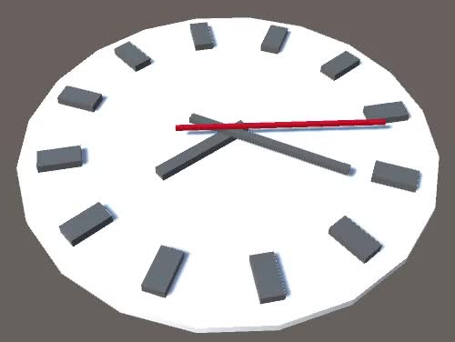

Clock with continuously rotating arms.

Now you know the fundamentals of object creation and scripting in Unity. The next step is Building a Graph.
